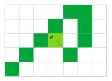

# Progetto pysnake

Nel gioco dello Snake, un serpente si muove su un campo rettangolare costituito da NxM quadratini. Il serpente all’inizio del gioco è costituito da un unico quadratino. Ogni quadratino del campo può:
* contenere cibo;
* contenere un ostacolo;
* essere vuoto.

Valgono le seguenti regole di gioco:
* la testa del serpente può muoversi nelle seguenti otto direzioni:
    * N – Nord;
    * S – Sud;
    * E – Est;
    * W – Ovest;
    * NE – Nord-Est;
    * NW – Nord-Ovest;
    * SE – Sud-Est;
    * SW – Sud-Ovest;
* oltrepassando un bordo del campo, il serpente riappare dal bordo opposto;
* quando il serpente “mangia” cibo il suo corpo cresce di un quadratino;
* quando il serpente si scontra con un ostacolo, il gioco termina;
* quando il serpente si scontra contro la sua stessa coda, il gioco termina. Ciò vale anche quando il serpente tenta di attraversare la sua coda in direzione diagonale, come rappresentato nella figura seguente.



## Il campo da gioco

Il campo da gioco iniziale può essere rappresentato secondo due diversi formati:
* un’immagine bitmap, in cui i quadratini hanno un diverso colore in base al loro contenuto;
* un file Json.

Nel caso di file Json, la rappresentazione può essere simile alla seguente.

```
{
  "rows": 4,
  "cols": 6,
  "food": [
    [0, 4],
    [2, 2],
    [3, 2]
  ],
  "blocks": [
    [0, 2],
    [1, 1],
    [3, 1]
  ]
}
```	

I quadratini vuoti non sono rappresentati nel file Json.

## Il file di gioco

Una partita è descritta da un file Json. Di seguito ve ne è un esempio.

```
{
  "field_in": "field_in_01.png",
  "start": [5, 3],
  "moves": "N N N E SE SE SE E E N N N W W W W W W W S S S S S S SW SW SW",
  "field_out": "field_out_01.png"
}
```

L'attributo `field_in` indica il file contenente il campo di gioco iniziale. L'estensione del campo può essere `.png` nel caso di formato bitmap o `.json` nel caso di file Json. L'attributo `start` contiene la posizione iniziale della testa del serpente. L'attributo `moves` contiene l'elenco delle mosse compiute dalla testa del serpente. Durante il suo movimento il serpente deve rispettare le regole precedentemente indicate. Il gioco termina quando si esauriscono le mosse elencate oppure, prematuramente, in caso di scontro. Il campo `field_out` contiene il nome del file sul quale deve essere salvato il campo di gioco nel suo stato finale.

## L'obiettivo

Obiettivo del progetto è implementare la funzione

```
def play(game_file: str) -> int:
  pass
```

che accetta in ingresso il nome di un file di gioco e restituisce in uscita la dimensione finale del corpo del serpente al termine del gioco. Come effetto collaterale, la funzione deve salvare su disco il file con lo stato finale del campo di gioco. Oltre agli ostacoli ed al cibo residuo, il campo di gioco contiene anche il corpo del serpente e, in un diverso colore, tutta la scia lasciata dal serpente durante la partita. Tutto il codice realizzato dallo studente deve essere contenuto nell'unico file `main.py`.

I quadratini del campo di gioco sono colorati secondo la seguente tabella.

* vuoto - nero = RGB(0, 0, 0)
* cibo - arancio = RGB(255, 128, 0)
* ostacolo - rosso = RGB(255, 0, 0)
* corpo - verde = RGB(0, 255, 0)
* scia - grigio = RGB(128, 128, 128)